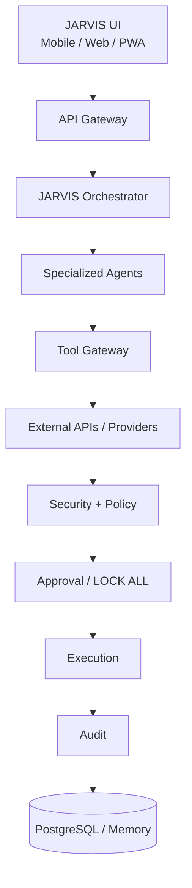

# JARVIS Architecture

## Authoritative high-level flow



Policy is evaluated before side effects, and server-side LOCK ALL is checked immediately before execution.

## Ownership and boundaries

- **Frontend:** React/Vite/TypeScript feature ownership for dashboard, security, permissions, approvals, agents, tasks, clients, finance, communications, content, integrations, and settings where implemented. It renders server results and never accesses a database directly.
- **Backend:** domain modules own business rules and authorization orchestration. Backend exposes the API boundary and safe errors.
- **Agents registry:** stores independent agent identity, enabled state, permissions, scope, and risk ceiling. Agents never inherit Owner/Admin rights.
- **Provider adapters:** isolate GitHub, Gmail, YouTube, Instagram, LinkedIn, storage, payments, AI, and future providers from domain logic. These are placeholders until implemented.
- **Repositories:** domain-facing interfaces isolate persistence. Supabase is a platform/data adapter, not business logic.
- **Android:** existing Kotlin/Jetpack Compose client remains isolated and untouched by web implementation batches.

## Dependency direction

```text
UI -> API/contracts -> domain modules -> repository/provider interfaces
                                  -> security/policy -> approval/audit
implementations -> interfaces (not the reverse)
```

Security and permissions must not form circular dependencies. Audit is a sink/service and does not call business modules.

## Security model

```text
Identity + Role + Permission + Resource Scope + Agent Risk Ceiling
+ Lock State + Risk Policy + Approval = ALLOW / DENY
```

Roles are Owner, Admin, Operator, and Viewer. Risks are LOW, MEDIUM, HIGH, and CRITICAL. Unknown risk is CRITICAL; unknown permissions, scopes, and actions deny.

## Future components

- **Skill/tool registry:** typed schemas, required permission, scope, maximum risk, approval, timeout, and audit policy.
- **Scheduler:** policy-aware, idempotent server-side jobs; no bypass of lock or approval.
- **Voice gateway:** `Mobile/Web Voice UI -> Voice Gateway -> Conversation Service -> Orchestrator -> Security Policy -> Agents/Tools`.
- **Memory:** scoped, access-controlled context; never a permission source by itself.

Production authentication, database, AI execution, integrations, scheduler, voice, and multi-agent workflows are future unless verified in source.
