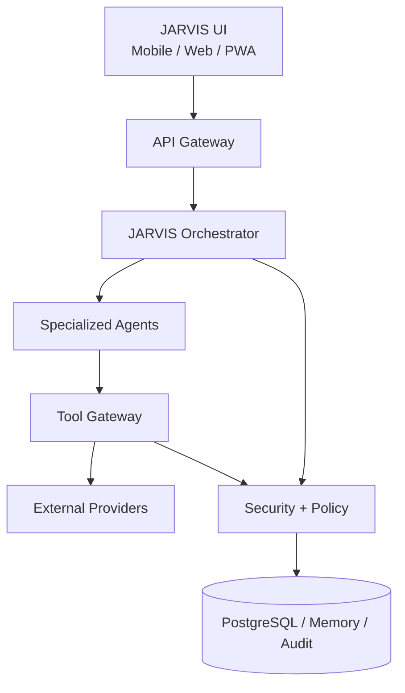
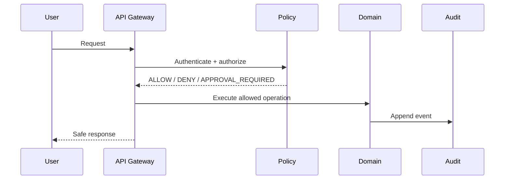
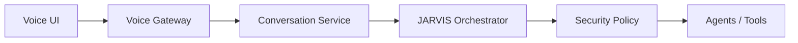

# JARVIS Architecture

## Current repository observation

The inspected `main` snapshot currently exposes only `README.md`. The structure below is the intended/current project organization when those implementation directories exist; names must be verified from the repository before adding code or updating paths. The existing Kotlin/Jetpack Compose Android client remains isolated from web batches.

## System architecture



- **UI:** responsive presentation and user intent capture; never direct database access.
- **API Gateway:** transport, request validation, authentication context, correlation IDs, and routing.
- **Orchestrator:** coordinates bounded agent work and workflow state; it does not bypass policy.
- **Specialized agents:** domain-oriented system actors with independent identity and risk ceilings.
- **Tool Gateway:** typed, allow-listed tool invocation boundary.
- **External providers:** email, finance, messaging, AI, and future integrations behind adapters.
- **Security + Policy:** authoritative identity, permission, scope, risk, lock, and approval decisions.
- **PostgreSQL / Memory / Audit:** persistence and observability. Audit is append-only and not a business-module caller.

## Intended repository organization

```text
frontend/
├── app/
├── features/
│   ├── dashboard/       ├── security/       ├── permissions/
│   ├── approvals/       ├── agents/         ├── tasks/
│   ├── clients/         ├── finance/       ├── communications/
│   ├── content/         ├── integrations/  └── settings/
├── components/ hooks/ lib/ services/ styles/ types/
backend/
├── app/ modules/ providers/ repositories/ security/ ...
```

The actual tree, package manifests, and module paths are authoritative over this intended map.

## Technology stack

The intended stack is React, TypeScript, Vite, React DOM, shared TypeScript contracts, Node.js, TypeScript, Express, ESM, and dotenv. The existing Android client is Kotlin/Jetpack Compose. Exact versions must be read from package manifests, never hardcoded from this document.

## Boundaries

- Frontend never accesses the database directly or receives Supabase service-role credentials.
- Backend owns authorization and business decisions.
- Backend domain logic depends on interfaces, not provider SDKs.
- Provider adapters isolate external services.
- Supabase is a platform/data adapter, not business logic.
- Android remains isolated from web implementation.
- Dashboard is read-oriented.
- Audit is a sink/service and does not call business modules.
- Security and permissions avoid circular dependencies.

## Core flows



- **Authentication:** client submits credentials/session proof; gateway validates it and creates request identity. Authentication does not grant authorization.
- **Authorization:** evaluate identity, role, permission, resource scope, agent risk ceiling, lock state, risk policy, and approval before side effects.
- **Task:** create/read/update task through backend domain APIs; assign bounded actors; record lifecycle changes.
- **Approval:** create a parameter-bound, expiring approval request; reviewer decides; execution re-checks lock and policy.
- **Agent/tool execution:** orchestrator selects an authorized agent; tool gateway validates action and policy; provider adapter executes only after required approval.
- **Emergency LOCK ALL:** security state is checked before every consequential side effect; active lock denies execution and fails closed.
- **Audit:** accepted, denied, approval, lock, and execution events are appended with correlation and actor context.

## Future voice architecture



The future design must allow English, Hindi, Hinglish, interruption/barge-in, low-latency conversation, and approval before consequential action. Voice is not part of the current dashboard batch.
